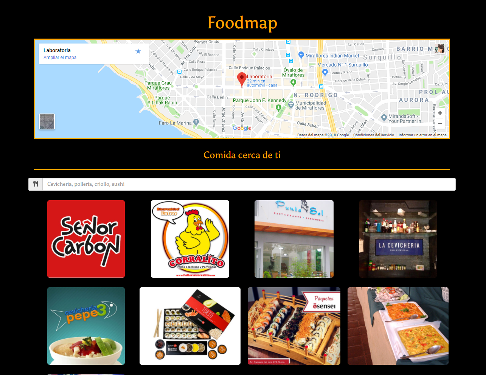

# FOODMAP

## Descripcion del proyecto:
  - Este proyecto contiene una una aplicacion responsive de busqueda de restaurantes generada de forma dinámica y consumiendo data interna para obtener la información.

## Desarrollado para [Laboratoria](http://laboratoria.la/codeacademy/)

2. **Autor:**

  - Lilliam Haro (v-apple)

3. **Herramientas utilizadas:**

  - HTML5
  - CSS3
  - Jquery
  - Bootstrap

4. **Criterios de Busqueda y filtrado**

  - Al utilizar un array de objetos hicimos que cada restaurant(objeto) tenga un propiedad llamada tags con lo que tendría que compararse al ingresar texto en el input

  - El buscador muestra los restaurantes con coincidan con lo ingresado en el input y los que no coinciden se ocultan

  - La forma de filtrado que se eligió fue por tipo de restaurantes que se muestran como guia mediante un placeholder en el input

  * FILTROS / TAGS:
  - cevicheria
  - polleria
  - sushi
  - criollo

  - El modal que aparece toma dinamicamente la información del restaurant seleccionado.
  - Los modales estan disponibles antes y despues de cada busqueda.

**VISTA DE LA APLICACIÓN EN ORDEN**

