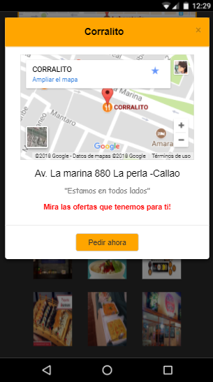

## README
1. **Descripcion del proyecto:**
  - Este proyecto contiene la simulacion de una aplicacion de busqueda de restaurantes

2. **Autor:**

  - Lilliam Haro (v-apple)

3. **Herramientas utilizadas:**

  - HTML5
  - CSS3
  - Jquery
  - Bootstrap

4. **Criterios de Busqueda y filtrado**

  - Al utilizar un array de objeto hicimos que cada restaurant(objeto) tenga un propiedad llamada tags con lo que tendría que compararse al ingresar texto en el input

  - La forma de filtrado que se eligio fue por tipo de restaurantes que se muestran como guia mediante un placeholder en el input

  * FILTROS :
  - cevicheria
  - polleria
  - sushi
  - criollo

**VISTA DE LA APLICACIÓN EN ORDEN**

